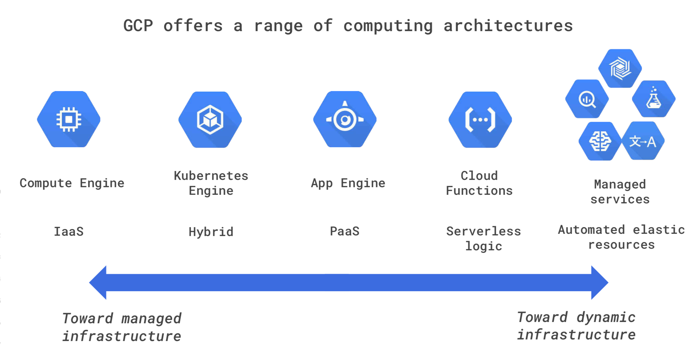
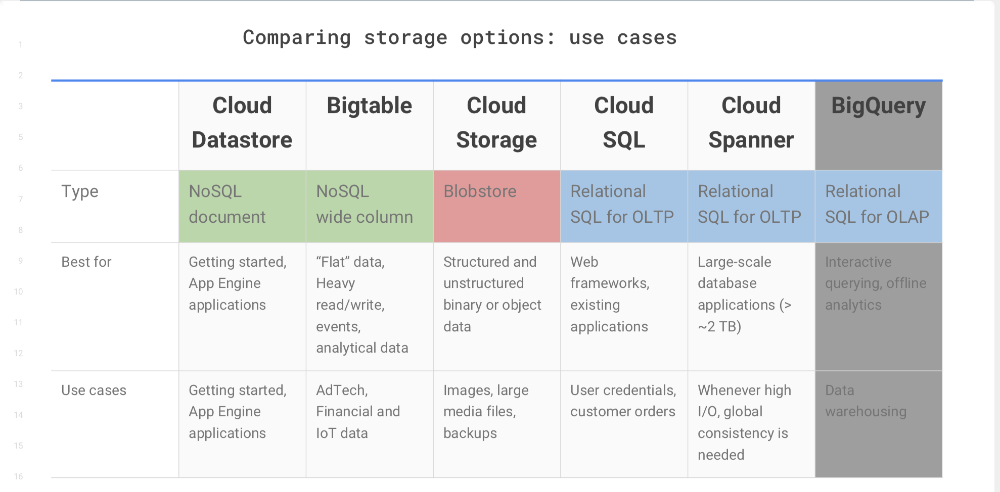
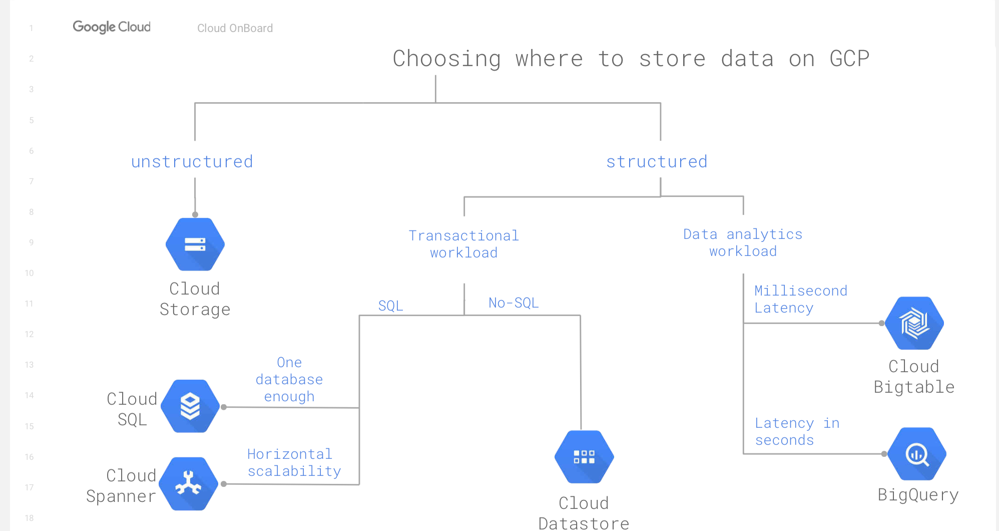
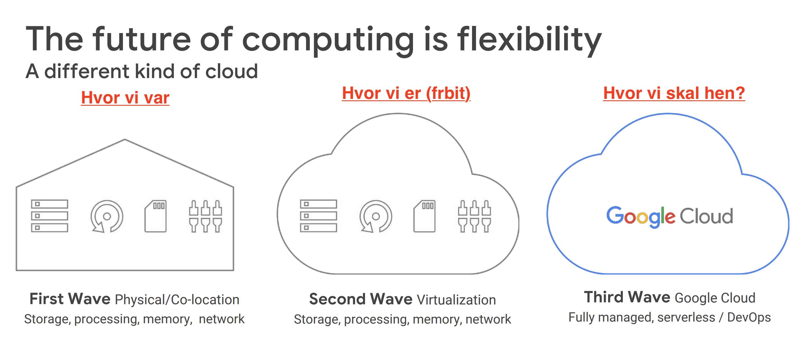

# Google Cloud Platform onBoarding

> Notes from Google Cloud Platform onBoarding event
> 22/05 2018

---

## Why GCP

- Best Network infrastructure in _the world_ (40% of all internet traffic!)
  - Entire network infrastructure is software-based, meaning no physical bottlenecks
  - Example: Pinging across continents takes 86ms, across countries takes 8ms, same country 0.3ms!!!
- Powerful security: Google is the most targeted platform, so security is high priority and built in to everything
  - Google's mantra: **trust nothing**
  - GCP means that Google manages most security aspects
- AI: lots of internal projects/usage
- Open platform: high flexibilty
- Fully managed, serverless - instead of having to control everything as a dev
  - Devs shouldn't have to manage amount of nodes
- Global Load Balancer with a single IP address - automatically redirect to best fitting CDN/VM

---

## Containers

Containers were created to help isolate materials being transfered by ships/trains/trucks.

**Definition:** Virtualises the name-space of your processes, so that they can only know and see themselves.

- Allocate ressources to different containers (app1 should only have 30% CPU)
- Containers can restart as needed, and doesn't make the entire VM crash
- Starting up new containers only take ms, where VMs takes minutes
- Google launches 4 **billion** new containers each week!
- VM overhead VS resiliency - should I have many small VMs or few larger VMs?

### Kubernetes

Orchestration of container clusters. Kubernetes makes applications more "elastic".

Features:

- Automated deployment, scaling and operations
- Open source
- Built for multi-cloud world (public, private, on-premise)
- Rolling updates - no downtime while upgrading
- Persistent storage

**Everything at Google is running in containers**

#### Pods

- A pod is an "application" with a single IP address
- Example: Frontend
- Can hold multiple containers
- Ressources (disk, buckets, etc) can be shared in pod
- If one "node" (VM) fails, we can move pod to another "node"

---

## The gCloud architecture

### Computing Portfolio

Google Cloud offers everyting between fully managed to automated/dynamic "applications".

#### 1. Compute Engine: IaaS

- Google provide CPU, memory, disks - you decide what to do with it.
- Managed VMs
- High load? Spin up more VMs
- Google will automatically recommend optimal VM specs
- Requires most security management: You must make sure that everything is updated, no security holes, management of user identity and api access
- [Preemptible machines](https://cloud.google.com/compute/docs/instances/preemptible) can save up to 80% of bills, if it's faul-tolerant and/or stateless!
- Autoscaling (even by custom metrics): If I have more than X active users, I want to spin up a new VM. 
  - Control min and max amount of instances
  - Metrics can be http load, cpu usage, or something custom
  - Spinning up new VMs takes a few minutes, so trigger the scaling **before** it's breaking down
  - Autohealing: Restart VM if it's unresponsive
  - Can be combined with preemptible machines (but make sure there's a delay between creating VMs, as they expire after 24hours)
- **Snapshot:** disk backup 
- Sustained use savings: If VM is running full month, you save approx 24%
- Load balancing
  - Geo-based: Redirect to closest VM instance
  - Url based: Low-cpu site can redirect to low-cpu VM

#### 2. Kubernetes Engine

- Kubernetes is open-soruce, but Kubernetes Engines manages and runs containers
- Fully managed cluster management 
- Decouple operational and development concerns
- Handles logging, health management, monitoring
- Complementary services: gCloud container builder, google container registry
- Hybrid between App Engine (PaaS) and Compute Engine (raw VM)

#### 3. App Engine

- The beginning of Cloud Platform
- PaaS for building scalable applications
- Serving 320 **billion** requests per day
- "you only pay for what you use" - usage based pricing **PERFECT FOR US?**
- DevOps layer is handled automatically - no need to patch OS and manage VMs
- Drawbacks of "standard" environment: 
  - Specific language versions, 
  - less customisation, 
  - 3rd party binaries not possible/more difficult
  - no writing to local disk
- Autoscale workloads to meet demands
- Separated dev and build - use SDK to deploy
- Built-in services such as Memcache, debugger, queues, logs, search
- **App engine flexible environment:** Bring you own Docker image
  - Pay for infrastructure (allocated ressources) vs pay for usage (used ress)
  - "I don't care about devOps, I just wanna build and deploy my Docker image"
  - Support for 3rd party binaries

#### 4. Cloud Endpoints (API)

- Develop, deploy and manage APIs on any Google Cloud backend
- Integrates well with APIGee
- Bring your own API or use built-in Python based

#### 5. Cloud functions

- Completely serverless functions 
- Currently only in JS/nodeJS (Python coming soon)
- Subscribes to events and can publicate new events
- AWS has Lambda
- Only pay for actual usage - if not used, it's not costing anything

---

### Storage & database portfolio

#### 1. Cloud Storage

> Binary large-object storage for persistent storage

- Based on buckets
- Use as a middle-step for data-storage or for backup/archive

#### 2. Cloud SQL

> Managed RDBMS (relational database management system)

- Can be used for MySQL and PostgreSQL instances
- Vertical scaling: Manage storage capacity, CPU, memory, etc. - high level of customisation, and price depends on this as well
- Automatic storage increase
- Automatic backups
- Slave/failover replica - in case DB fails, we have a fallback ready
- Automatic maintenance 

#### 3. Cloud Spanner

> horizontally scalable RDBMS

- fully managed DBaaS with horisontal scaling
- automated data sharding
- A.C.I.D. Transactions
- Strong consistency and scalability
- battle-tested at Google
- Expensive, use for high I/O where global consistency is needed 

#### 4. Cloud Bigtable

> Managed NoSQL

- Fully managed NoSQL wide-column db service for terabyte application
- Useful for flat-hierachy data
- Internal load-balancing between DB nodes means high level of scaling (ex: 300 nodes = 3mio QPS)

#### 5. Cloud Datastore

> NoSQL designed for application backends

- Fully managed 
- Schema-less: No need to create schema from beginning
- Fully distributed, so easier to scale horisontally
- Battle-tested: PokemonGO used Cloud Datastore and handled 50x worst-case expected traffic
- Easily integrated with app engine

#### Comparison of data storage options

---

### Big data & Machine learning

#### 1. Pub/sub

> Publish / subscribe management event queue

- Can be sued to stream data on to Cloud Dataflow

#### 2. Cloud Dataflow

> Unified Data Processing

- Batch computation, conversions, structuring data
- Filtering, etc.

#### 3. Cloud Dataproc

> A managed service around services for processing big datasets

- Hadoop, Spark, Pig and Hive services
- Processing big datasets as a batch
- Creating clusters fast
- Scale clusters up and down while jobs are running
- Cost-effective: Pay for what you use
- Useful for migrating Hadoop jobs to cloud
  - Twitter is using it for migrating **300PB** of data

#### 4. BigQuery

> Data warehouse for analytics

- Petabyte-scale enterprise data warehouse for analytics
- Only spinning up servers when being used (so no need to keep massive DBs running when not used)
- Example: Querying 1pb table (3.000.000.000.000 rows) only takes 30 minutes
- Some of the big industry players use it: Spotify, Twitter

#### 5. Cloud Datalab

> A managed service for data science notebooks

- Exploratory interactive data science tool
- Useful for training models (MI)
- Integrating with [Jupyter](http://jupyter.org/) and leveraging exisiting Jupyter models

---

### Machine learning

A field of AI. A fairly "old" thing, but has gotten all the attention now that we have more computation and neural networks.

Machine learning requires:

1. Large datasets
2. Good models
3. Lots of computation power

#### Tools

D-I-Y: 

- TensorFlow and Cloud ML Engine for building machine learning models with your data
- Or train model with Cloud AutoML and Google's models
  - you bring the data (fx labeled images) and use the Google Vision model to train it. Evaluate and predict new images
  - Example: recognising different kinds of clouds
  - Great approach for getting started without being a super intelligent data scientist

Or use fully-trained models as APIs provided by Google:

- Cloud Vision
- Cloud Speech
- Cloud Translation
- Cloud Natural Language
- Cloud Video Intelligence
- Cloud Data Prevention Loss

---

## Monitoring on GCP

- The SRE (Site reliability Engineering) principle: Devs & sysOps agrees on balance
- Stackdriver
  - Monitoring
    - Uptime & health checks
    - Dashboards
  - Logging
    - Search, filter, export logs
  - Error reporting
  - Debugging
    - makes debugging easier without hurting performance
  - Tracing
    - Latency reporting
    - Per URL and statistics

---

## GCP Usage (getting started)

- The Web Console has everything (including "terminal")
- Mobile Apps are available too
- Cloud Launcher makes deploying "stacks" much easier (such as LAMP stack or a WordPress stack)
- Create new project for each environment (dev, staging, prod). This is **best practice**, but will also cost more.

---

## Lookup afterwards

- Forseti Security
- Cloud Harmony
- google cloud solutions
- cloud.google.com/certification

---

## TODO from here

1. Tjek specs på frbit vs gAppEngine og sammenlign priser med fx ds-prod eller nb-customer-api
2. Forsøg med én app, så vi kan teste hvordan det fungerer.
3. Undersøg integration med CI - kan vi fx lave deployment fra Bitbucket?
4. Flyt fx nb-customer-api til gAppEngine, da antallet af requests varierer vildt

